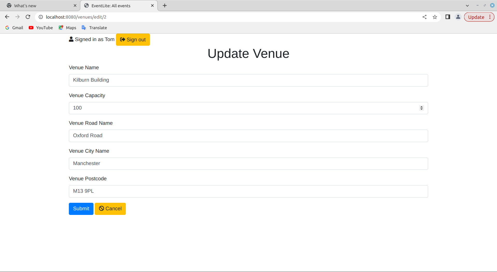

EventLite - Calendar Software
========
# Project Overview
EventLite is a calendar software developed using the Java Spring MVC framework. It is designed to allow administrators to create and manage events, and for regular users to view these events. Each event is associated with specific time and location details and integrates with the Google Maps API to provide location information.

## Functions
### Administrator Functions:
    * Login: Administrators can log in using their credentials. 

    * Create Events: Administrators can create new events, specifying the date, time, location, and other details.    
    * Edit Events: Administrators can edit the information of previously created events.
    * Delete Events: Administrators can remove events that are no longer needed.


    * Location management: The software leverages the Mapbox Maps API to associate events with specific venues.
 

### Regular User Functions:
    * Login: Regular users can log in using their username and passwords.
    * View Events: Users can browse a list of available events and view detailed information.
    * Map Integration: Location information is provided by the MapBox API, allowing users to view event locations on a map.

# Deployment Guide | Getting started
## 1. Clone the Repository:
Use terminal to enter command line:```git clone https://github.com/Ray7788/EventLite.git```
## 2. Build the Project: 
    - Compile the project using a build tool such as Maven or Gradle(IDE would more convenient).
    - Deploy the WAR File: Deploy the generated WAR file to your application server (e.g., Tomcat).
## 3. Setup Database
Create a MySQL database and configure the connection properties in `application.properties` file.

    - System Requirements: Ensure your server meets the requirements for Java and the chosen database.
    - Set Configure database connection information (e.g., username, password, database URL).

## 4. Configure the Application: 
Set environment variables or property files on the application server, including database connection details and the Google Maps API key.

## 5. Start the Application: 
Launch the application server to ensure the EventLite application starts successfully.

# Technology Stack
- Backend:
    - Java Spring MVC Framework: The core framework used for building the backend of the application. It provides a structured and modular approach to developing web applications.
    - Database:
        Database System: You can choose the database system that best suits your requirements. Common choices include:
        * MySQL: A popular open-source relational database management system.
        * PostgreSQL: Another open-source relational database system known for its advanced features and reliability.
    - API Integration:
      - Mapbox Maps API: Integrated for location-related functionalities. It allows you to display event locations on maps and provide location-based information to users.
    - Build and Dependency Management:
    Maven/Gradle: These build tools are commonly used in Java projects to manage dependencies, build, and package the application.
- Frontend:
    - HTML: The standard markup language for creating web pages and user interfaces.
    - CSS: Cascading Style Sheets are used for styling the user interface and defining the visual layout of the application.
    - JavaScript: A programming language used for adding interactivity and dynamic behavior to web pages.

# Contributing
If you wish to contribute to the project, follow these steps:

- Fork the project and clone it to your local machine.
- Create a branch for your changes.
- Commit your changes and create a pull request, describing your modifications for review.

# License
This project is licensed under the BSD License.

